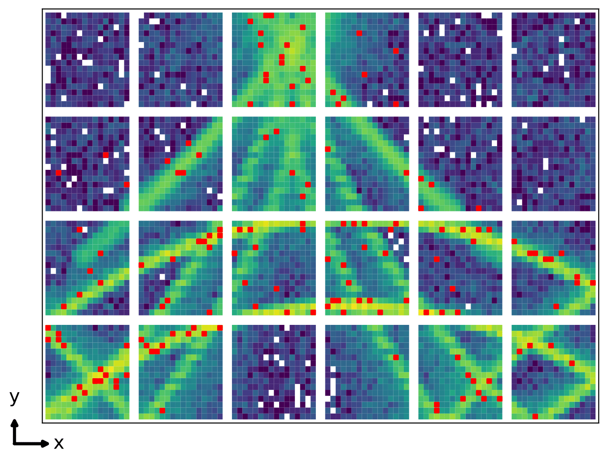
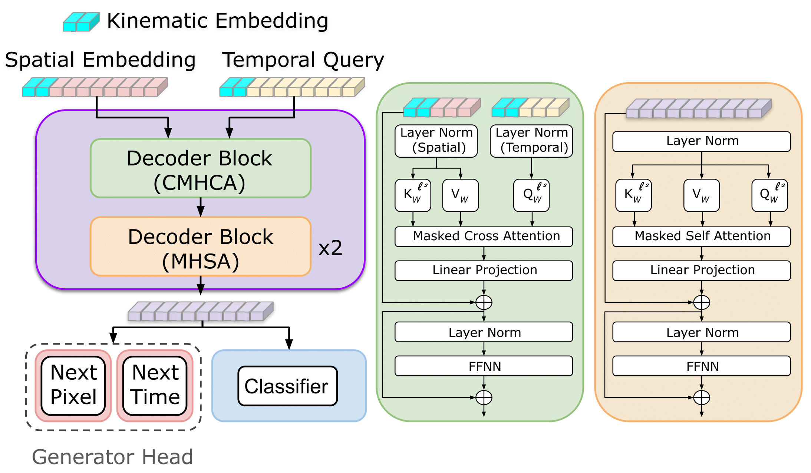

# [Foundation Models for Chernekov Detectors at GlueX](https://iopscience.iop.org/article/10.1088/2632-2153/ae3d81)

## Abstract

This repository implements foundation models for fast simulation and reconstruction of Cherenkov detector readouts at the GlueX experiment. Our approach combines generative modeling with mixture-of-experts architectures to efficiently simulate detector responses and perform event classification and filtering.



## Table of Contents
- [Data](#data-used-for-training)
- [Environment Setup](#environment)
- [Architecture](#architecture)
- [Training](#training)
- [Evaluation](#evaluation)
- [Citations](#citations)


## Data used for Training

The data used for training our models is inherited from [Deep(er)RICH](https://iopscience.iop.org/article/10.1088/2632-2153/ada8f4).

## Environment 

Noteable requirements: 

- Python:     3.12.8
- Pytorch:    2.5.1
- CUDA:       12.4

**Installation:**

```bash
conda env create -f env.yml
```

If specific packages fail to install via conda, install them with pip after activating the environment:

```bash
pip install <package_name>
```

We have also provided a requirements.txt file for pip users.

## Architecture



More information regarding the architecture can be found [here](https://iopscience.iop.org/article/10.1088/2632-2153/ae3d81). 

## Training

All training is configuration-driven via JSON config files. We provide three main training scripts:

### Generative Model Training

```bash
torchrun --nproc-per-node=NUM_GPUS train_dist.py --config config/GlueX_config.json
```

Default configuration uses 4 experts in the Mixture-of-Experts layer. Customize experts and other hyperparameters in the config file.

### Classification Model Training

```bash
torchrun --nproc-per-node=NUM_GPUS train_dist_cls.py \
  --config config/GlueX_config.json \
  --fine_tune_path /path/to/pretrained_generative.pth
```

Optional fine-tuning from pre-trained generative models. If the generative model uses Mixture-of-Experts, expert weights are averaged.

### Filtering Model Training

```bash
torchrun --nproc-per-node=4 train_dist_filtering.py --config config/GlueX_config.json
```

Optional fine-tuning from pre-trained generative models is also supported.

**Note:** Classification and filtering models do not use the Mixture-of-Experts layer by default.

## Evaluation

### Classification & Filtering Evaluation

Evaluate classification and filtering models:

```bash
python eval_classifier_GlueX.py --config config/GlueX_config.json
python eval_filtering_GlueX.py --config config/GlueX_config.json
```

Outputs include precision, recall, F1 scores, and ROC/AUC curves saved to `Inference/` directories.

### Generative Model Evaluation

Generative models are evaluated through visual inspection of 2D hit ring structures and temporal ratio plots. Evaluation requires Geant4 reference data:

```bash
chmod +x generate_GlueX.sh
./generate_GlueX.sh
```

Within the generate_GlueX.py file, you can control which combinations along bar faces, and bars are to be generated.

## Generation Visualizer

Cole add a description here. We could also let them generate data like in the other FM paper and plot the hit patterns, this is more work.    

# Citations

Previous work from which we inherit the architecture.

```
@article{giroux2026towards,
  title={Towards foundation models for experimental readout systems combining discrete and continuous data},
  author={Giroux, James and Fanelli, Cristiano},
  journal={Machine Learning: Science and Technology},
  volume={7},
  number={1},
  pages={015031},
  year={2026},
  publisher={IOP Publishing}
}
```

Previous work from which we inherit the dataset.

```
@article{fanelli2025deep,
  title={Deep (er) reconstruction of imaging Cherenkov detectors with swin transformers and normalizing flow models},
  author={Fanelli, Cristiano and Giroux, James and Stevens, Justin},
  journal={Machine Learning: Science and Technology},
  volume={6},
  number={1},
  pages={015028},
  year={2025},
  publisher={IOP Publishing}
}
```